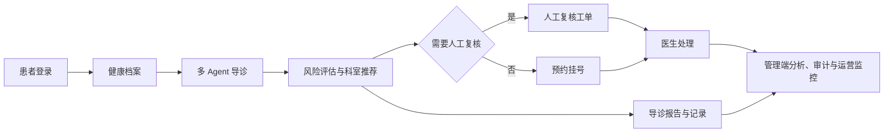

# 多 Agent 智能导诊平台

[](https://golang.org/)
[](LICENSE)
[](https://github.com/niemeyerrybij438-maker/smart-triage-agent/actions/workflows/ci.yml)
[](https://github.com/cloudwego/eino)
[](./docs/TECHNICAL_SPECIFICATION.md)
[](./docs/TECHNICAL_SPECIFICATION.md)
[](./docs/TECHNICAL_SPECIFICATION.md)

面向患者、医生和平台管理员的三端智能导诊系统。系统以 `TriageHarness` 统一管理运行状态，强制执行医疗知识 RAG，通过多 Agent 完成症状理解、风险分级与科室推荐，再由 Loop Engine 驱动 AI Review 最多两轮审核收敛，并将导诊、人工复核、预约和 Agent 轨迹串成可追溯业务闭环。

> **医疗安全声明：** 本系统用于就医前分诊辅助和流程协同，不提供疾病诊断、处方或治疗方案，不能替代医生面诊、急诊服务和医疗机构正式意见。

## 项目概览

| 项目 | 说明 |
| --- | --- |
| 项目名称 | 多 Agent 智能导诊平台 |
| 服务对象 | 患者、医生、平台管理员 |
| 核心目标 | 降低患者挂号选择成本，提前结构化采集信息，识别高风险场景并提升分诊协同效率 |
| 技术栈 | Go、AGGO、CloudWeGo Eino、MySQL、SSE、RAG、Harness、Loop Engine、百度地图 |
| 系统形态 | 患者端 + 医生端 + 管理端 + 医疗知识库 + Agent 可观测链路 |
| 项目代码 | [`example/`](./example) |
| RAG 状态 | 已进入导诊固定链路；公开可追溯知识 Top 3 检索 |
| 质量控制 | AI Review 最多两轮；每轮结果写入 Agent 轨迹 |
| 运行编排 | Triage Harness + 有界 Loop Engine |

## 三端入口

服务默认运行在 `http://localhost:8080`。

| 端 | 登录入口 | 主要能力 |
| --- | --- | --- |
| 患者端 | `http://localhost:8080/patient/login` | 验证码登录、健康档案、多轮导诊、报告历史、预约、宿迁医院地图与导航 |
| 医生端 | `http://localhost:8080/doctor/login` | 待处理患者、风险报告、协同诊断、人工复核、急诊通道、预约确认与 PDF 导出 |
| 管理端 | `http://localhost:8080/admin/login` | 导诊分析、Agent 轨迹、工单与预约监控、风险规则、账号权限、系统配置与审计 |

账号由父目录私有 `.env` 中的环境变量管理。不要将真实账号、密码、模型密钥、数据库 DSN、短信服务密钥或百度地图 AK 提交到仓库。

## 业务闭环



导诊、预约、人工复核工单和 Agent 轨迹以 `sessionId` 关联，便于从管理端或医生端回溯同一次患者导诊过程。

## 多 Agent 协作

系统并非单一聊天机器人，而是由 Triage Harness 管理运行状态、Loop Engine 驱动 AI Review 收敛，并由主控 Agent 编排专业节点完成业务处理：

1. **意图识别**：判断用户诉求和是否进入医疗导诊流程。
2. **医疗知识 RAG 与病史摘要**：检索公开可追溯的分诊知识，并融合当前对话与患者档案。
3. **风险评估**：输出 `P1`、`P2`、`P3` 分级，并识别需要急诊提示的情形。
4. **科室推荐**：给出首选科室、备选科室、推荐依据与就诊准备事项。
5. **条件化分析**：按需执行急症识别或用药安全分析。
6. **监督汇总**：主控 Agent 协调各节点结果，生成面向患者的导诊建议。
7. **AI Review Loop 与记录提取**：最多两轮检查并修正安全表达，写入结构化导诊记录和 Agent 执行轨迹。

详细设计请查看 [`docs/MULTI_AGENT_ARCHITECTURE.md`](./docs/MULTI_AGENT_ARCHITECTURE.md)。

## 运行架构与质量控制

每次患者导诊都由 `TriageHarness` 管理完整运行状态，而不是由页面直接串行调用多个模型：

```text
患者消息 + 健康档案
  -> 会话记忆检索 + 医疗知识 RAG（Top 3、带来源）
  -> 主导诊 Agent
  -> Intent 调度与专业 Agent 并发分析
  -> Supervisor 汇总
  -> AI Review Loop（最多 2 轮修正）
  -> SSE 返回结果
  -> 异步保存导诊记录、预约/工单关联和 Agent 轨迹
```

- RAG 初始知识来自 MedlinePlus、WHO 等公开资料，覆盖胸痛/呼吸困难、卒中、大出血、发热、呼吸道、腹痛和用药过敏边界；每条知识都保存来源 URL。
- `medical-knowledge-rag`、`main-triage`、专业 Agent、`supervisor`、`ai-review` 都写入 Agent 轨迹，管理端可按会话回溯。
- AI Review 负责检查急症遗漏、过度诊断、用药越界和特殊人群风险；循环有上限，避免无限调用。
- 公开资料只作为分诊参考，不输出诊断或个体化处方；高风险规则不会因 RAG 未命中而被降低。
## 核心能力

### 患者端

- 手机验证码登录；开发环境使用本地验证码，生产环境可接入短信服务。
- 健康档案维护、BMI 计算、历史对话和新建会话。
- 多 Agent 导诊进度、风险分级、科室推荐、就诊提醒。
- 导诊报告搜索、筛选、排序、分页与 PDF 下载。
- 宿迁医院地图、定位和导航。
- 预约挂号、状态查看与确认前取消。

### 医生端

- 按风险、状态和时间筛选待处理患者。
- 查看患者档案、导诊记录和风险报告历史。
- 协同诊断、人工复核工单处理与 P1 急诊绿色通道。
- 预约确认、完成处理和导诊报告 PDF 导出。
- 随访任务中心按优先级汇总待反馈、逾期、已完成和异常升级任务，支持多条件筛选、报告联动与下一轮随访创建。
- 医生确认处理完成后，分诊记录、人工复核工单和异常随访任务同步收口，避免同一业务在不同页面显示冲突状态。
- 医生处置方式、处置意见、处理人和处理时间持久化保存，并通过患者通知、三端页面和管理端 CSV 形成可追溯回传链路。

### 管理端

- 导诊记录与风险统计分析。
- Agent 轨迹按会话、节点、状态和耗时筛选。
- 人工复核 SLA、后端截止时间、超时自动升级和关联导诊/轨迹跳转。
- 预约监控、风险规则、医疗知识审核/启停/版本治理、医生账号与权限管理。
- 平台配置持久化与管理员审计日志。

## 技术架构

```text
前端页面（患者端 / 医生端 / 管理端）
        │
        ▼
Go HTTP + SSE 服务（example/sse）
        │
        ├── 认证与权限控制
        ├── 多 Agent 导诊编排（AGGO + Eino）
        ├── 导诊、工单、预约、报告与 PDF 服务
        ├── Agent 轨迹与管理端审计
        └── 百度地图与短信服务适配
        │
        ▼
MySQL（患者档案、对话、导诊记录、预约、工单、规则、账号、审计）
```

AGGO 是本项目的 Agent 技术底座，提供 Agent 编排、对话能力、SSE 流式响应、记忆与工具调用等基础能力；导诊系统在其上实现了面向医疗分诊场景的多 Agent 协作和三端业务流程。

## 文档导航

| 文档 | 内容 |
| --- | --- |
| [`example/README.md`](./example/README.md) | 完整配置、启动、三端使用、测试、权限与验收说明 |
| [`docs/PRD_SMART_TRIAGE.md`](./docs/PRD_SMART_TRIAGE.md) | 产品需求、用户角色、业务目标与边界 |
| [`docs/SMART_TRIAGE_PLAN.md`](./docs/SMART_TRIAGE_PLAN.md) | 产品与技术方案、业务流程与阶段规划 |
| [`docs/MULTI_AGENT_ARCHITECTURE.md`](./docs/MULTI_AGENT_ARCHITECTURE.md) | 多 Agent 职责划分、编排与数据流设计 |
| [`docs/DATABASE_DESIGN.md`](./docs/DATABASE_DESIGN.md) | 数据库设计原则、实体关系与核心字段 |
| [`docs/TECHNICAL_SPECIFICATION.md`](./docs/TECHNICAL_SPECIFICATION.md) | 正式技术说明：系统架构、数据库、多 Agent、RAG、SSE、安全与可靠性 |
| [`memory/README.md`](./memory/README.md) | AGGO 记忆模块说明 |
| [`database/README.md`](./database/README.md) | AGGO 向量数据库模块说明 |

## 快速启动

### 环境要求

- Go `1.25.x` 或兼容版本。
- MySQL `8.x`。
- OpenAI 兼容模型服务。
- 百度地图 JavaScript API GL AK（地图能力需要）。

### 配置环境变量

在 `example` 目录复制模板到父目录：

```powershell
Copy-Item .\example\.env.example .\.env
```

至少配置：

```text
BaseUrl
APIKey
MYSQL_DSN
DOCTOR_USERNAME
DOCTOR_PASSWORD
ADMIN_USERNAME
ADMIN_PASSWORD
BAIDU_MAP_AK
```

`BaseUrl`、`APIKey` 和 `MYSQL_DSN` 在所有运行环境中均为必填项，服务不内置默认数据库密码。设置 `APP_ENV=production` 后会启用严格启动校验：医生端和管理端必须使用自定义账号密码，密码至少 12 位且不能使用演示密码；同时必须配置百度地图 AK，以及互亿无线账号密码或自定义短信服务地址。开发环境可保留本地调试账号和短信 `debugCode`，但不得用于正式部署。

创建数据库后启动。应用会通过 GORM 自动创建或更新所需表：

```sql
CREATE DATABASE aggo CHARACTER SET utf8mb4 COLLATE utf8mb4_unicode_ci;
```

### 启动服务

```powershell
cd .\example
.\start.cmd
```

指定端口：

```powershell
.\start.cmd -Port 8090
```

更多环境行为、短信调试方式与部署注意事项见 [`example/README.md`](./example/README.md)。

### Docker Compose

仓库根目录提供 `Dockerfile`、`docker-compose.yml` 和 `.dockerignore`。准备好私有 `.env` 后可一键启动应用与 MySQL：

```powershell
docker compose up -d --build
docker compose ps
Invoke-RestMethod http://localhost:8081/ready
```

Docker 默认映射到宿主机 `8081`，与本地 `8080` 服务并行运行，可通过 `DOCKER_PORT` 覆盖。应用容器使用非 root 用户运行，内置中文 PDF 字体和 `/ready` 健康检查；MySQL 使用命名卷持久化。生产环境必须覆盖 Compose 的本地数据库默认密码，并设置 `APP_ENV=production`。

## 质量与安全基线

- `.env`、模型密钥、数据库 DSN、登录密码、短信密钥和地图 AK 均由忽略规则排除，不进入版本控制。
- 服务启动时集中校验必要配置；生产模式拒绝空配置、弱演示密码和缺失的短信服务。
- 未登录访问患者、医生和管理端受保护 API 时返回 `401`。
- 患者仅能访问自己的档案、对话、报告、工单和预约。
- 医生停用或密码重置后，已有医生会话立即失效。
- 导诊、预约和人工复核采用受限状态流转，保留审计记录。
- 本地验收覆盖三端登录、退出失效、数据关联、管理端接口读取、测试、静态检查和构建。
- GitHub Actions 在推送或提交 Pull Request 时自动执行单元测试、`go vet`、Go 构建和 Docker 镜像构建验证。

### 基础持续集成

流水线定义位于 [`.github/workflows/ci.yml`](./.github/workflows/ci.yml)，只负责代码质量验证，不包含自动部署，也不会读取项目 `.env` 或任何线上密钥。CI 包含两个容易说明的任务：

1. **Go 质量检查**：运行 `go test`、`go vet`，并确认服务能够编译。
2. **Docker 构建检查**：根据仓库 `Dockerfile` 构建镜像，但不推送到镜像仓库。

面试时可概括为：每次提交代码后自动检查测试、静态问题和构建结果，减少无法运行的代码进入主分支。

运行验证：

```powershell
cd .\example
go test .\sse -count=1
go vet .\sse
go build -o .\aggo-sse-new.exe .\sse
```

可一键生成覆盖率并执行三端只读验收：

```powershell
cd .\example
.\test.ps1 -Coverage -Acceptance -RequireDemoData
```

RAG 检索与 Agent 调度回归评测：

```powershell
go test .\sse -run "Test(RAGRetrievalEvaluationDataset|AgentDispatchEvaluationDataset)$" -count=1 -v
```

执行本地只读 API 性能基线：

```powershell
go run .\cmd\perfcheck -requests 50 -concurrency 10 -max-p95-ms 4000 -json performance-report.json
```

详细指标见 [性能基线](./docs/PERFORMANCE_BASELINE.md)。

## 项目结构

```text
aggo/
|-- example/                   # 智能导诊应用代码与三端页面
|   |-- sse/                   # HTTP 服务、业务模块、Agent 与测试
|   |-- README.md              # 应用使用和交付说明
|   `-- .env.example           # 环境变量模板
|-- docs/                      # PRD、技术方案、多 Agent 架构、数据库设计
|-- agent/                     # AGGO Agent 框架能力
|-- memory/                    # 记忆模块
|-- database/                  # 向量数据库模块
|-- model/                     # 模型接入
|-- tools/                     # 工具调用能力
`-- README.md                  # 项目总览（当前文档）
```

## 技术底座：AGGO 框架

本仓库同时保留 AGGO 框架能力，供智能导诊平台调用和扩展：

- 基于 CloudWeGo Eino 的 ReAct Agent、工具调用、多轮对话和 SSE 流式响应。
- 会话记忆、长期记忆、摘要和多种存储后端。
- 知识库、数据库、Shell、定时任务等工具生态。
- OpenAI 兼容模型、GLM、Langfuse 与 AILens360 等扩展能力。

框架相关模块可按需查看 [`agent/`](./agent)、[`memory/`](./memory)、[`database/`](./database)、[`tools/`](./tools) 和 [`pkg/`](./pkg)。

## 开源许可

本项目采用 [MIT 许可证](LICENSE) 开源。

## 登录会话持久化

三端登录会话已由单纯内存缓存改为“内存缓存 + 数据库恢复”。会话元数据写入 `persistent_session`，Token 仅以 SHA-256 摘要形式存储。应用重启后，现有 Cookie 可继续恢复患者、医生和管理员身份。

## 随访报表与导出

随访管理页支持多条件联合筛选和 CSV 导出。导出由服务端重新应用筛选条件，避免只导出前端当前显示数据。患者手机号按 `195****5183` 格式脱敏，并对 CSV 公式注入进行防护。
