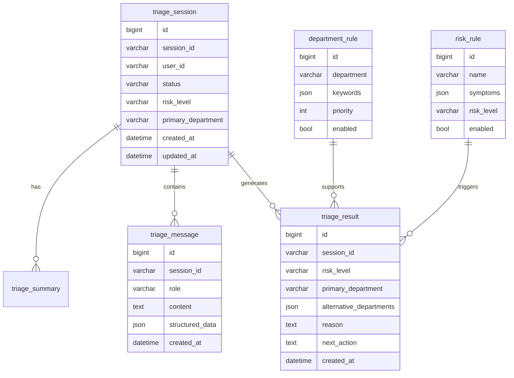

# 智能导诊数据库表设计

## 1. 设计原则

智能导诊系统需要把 Agent 记忆和业务数据分开存储。

- 记忆数据用于模型上下文和会话连续性。
- 业务数据用于导诊记录、分诊结果、规则管理和后续统计。
- 业务表需要结构化，便于查询、审计和管理后台展示。
- 涉及健康信息的字段后续需要考虑权限、脱敏和审计。

## 2. 表关系概览



## 3. 表结构详情

### 3.1 triage_session

导诊会话主表，一次完整导诊流程对应一条记录。

```sql
CREATE TABLE triage_session (
    id BIGINT PRIMARY KEY AUTO_INCREMENT,
    session_id VARCHAR(64) NOT NULL UNIQUE COMMENT '会话ID',
    user_id VARCHAR(64) DEFAULT NULL COMMENT '用户ID',
    status VARCHAR(32) NOT NULL DEFAULT 'active' COMMENT 'active/completed/transferred/cancelled',
    source VARCHAR(32) DEFAULT 'web' COMMENT '来源：web/app/admin',
    risk_level VARCHAR(16) DEFAULT NULL COMMENT 'P0/P1/P2/P3',
    primary_department VARCHAR(64) DEFAULT NULL COMMENT '首选推荐科室',
    summary TEXT DEFAULT NULL COMMENT '导诊摘要',
    created_at DATETIME NOT NULL DEFAULT CURRENT_TIMESTAMP,
    updated_at DATETIME NOT NULL DEFAULT CURRENT_TIMESTAMP ON UPDATE CURRENT_TIMESTAMP,
    INDEX idx_user_id (user_id),
    INDEX idx_status (status),
    INDEX idx_risk_level (risk_level),
    INDEX idx_created_at (created_at)
) COMMENT='导诊会话表';
```

字段说明：

| 字段 | 说明 |
|---|---|
| session_id | 前后端传递的会话 ID |
| user_id | 登录用户或匿名用户 ID |
| status | 会话状态 |
| source | 会话来源 |
| risk_level | 当前最终风险等级 |
| primary_department | 当前最终推荐科室 |
| summary | 最新摘要 |

### 3.2 triage_message

导诊消息表，保存用户、助手、系统和工具消息。

```sql
CREATE TABLE triage_message (
    id BIGINT PRIMARY KEY AUTO_INCREMENT,
    session_id VARCHAR(64) NOT NULL COMMENT '会话ID',
    role VARCHAR(32) NOT NULL COMMENT 'user/assistant/system/tool',
    agent_name VARCHAR(64) DEFAULT NULL COMMENT '产生消息的Agent名称',
    content TEXT NOT NULL COMMENT '消息内容',
    structured_data JSON DEFAULT NULL COMMENT '结构化抽取结果',
    created_at DATETIME NOT NULL DEFAULT CURRENT_TIMESTAMP,
    INDEX idx_session_id (session_id),
    INDEX idx_role (role),
    INDEX idx_created_at (created_at)
) COMMENT='导诊消息表';
```

字段说明：

| 字段 | 说明 |
|---|---|
| role | 消息角色 |
| agent_name | 多 Agent 场景下记录来源 Agent |
| content | 原始文本内容 |
| structured_data | 症状槽位、工具结果等 JSON |

### 3.3 triage_symptom_slot

症状槽位表，保存从对话中抽取出的结构化症状信息。

```sql
CREATE TABLE triage_symptom_slot (
    id BIGINT PRIMARY KEY AUTO_INCREMENT,
    session_id VARCHAR(64) NOT NULL COMMENT '会话ID',
    chief_complaint VARCHAR(255) DEFAULT NULL COMMENT '主诉',
    symptom_location VARCHAR(255) DEFAULT NULL COMMENT '症状部位',
    duration VARCHAR(128) DEFAULT NULL COMMENT '持续时间',
    severity VARCHAR(64) DEFAULT NULL COMMENT '严重程度',
    onset_type VARCHAR(64) DEFAULT NULL COMMENT '起病方式',
    accompanying_symptoms JSON DEFAULT NULL COMMENT '伴随症状',
    temperature VARCHAR(64) DEFAULT NULL COMMENT '体温',
    age INT DEFAULT NULL COMMENT '年龄',
    gender VARCHAR(32) DEFAULT NULL COMMENT '性别',
    pregnancy VARCHAR(32) DEFAULT NULL COMMENT '孕产相关',
    medical_history JSON DEFAULT NULL COMMENT '既往史',
    allergy_history JSON DEFAULT NULL COMMENT '过敏史',
    medication JSON DEFAULT NULL COMMENT '当前用药',
    emergency_signs JSON DEFAULT NULL COMMENT '危急信号',
    created_at DATETIME NOT NULL DEFAULT CURRENT_TIMESTAMP,
    updated_at DATETIME NOT NULL DEFAULT CURRENT_TIMESTAMP ON UPDATE CURRENT_TIMESTAMP,
    UNIQUE KEY uk_session_id (session_id)
) COMMENT='导诊症状槽位表';
```

### 3.4 triage_result

分诊结果表，一次会话可以生成多次阶段性结果，最终结果以 `is_final = true` 标记。

```sql
CREATE TABLE triage_result (
    id BIGINT PRIMARY KEY AUTO_INCREMENT,
    session_id VARCHAR(64) NOT NULL COMMENT '会话ID',
    risk_level VARCHAR(16) NOT NULL COMMENT 'P0/P1/P2/P3',
    primary_department VARCHAR(64) DEFAULT NULL COMMENT '首选科室',
    alternative_departments JSON DEFAULT NULL COMMENT '备选科室',
    matched_department_rules JSON DEFAULT NULL COMMENT '命中的科室规则',
    matched_risk_rules JSON DEFAULT NULL COMMENT '命中的风险规则',
    reason TEXT DEFAULT NULL COMMENT '推荐理由',
    next_action TEXT DEFAULT NULL COMMENT '下一步建议',
    safety_notice TEXT DEFAULT NULL COMMENT '安全提示',
    preparation JSON DEFAULT NULL COMMENT '就诊准备建议',
    is_final BOOLEAN NOT NULL DEFAULT FALSE COMMENT '是否最终结果',
    created_at DATETIME NOT NULL DEFAULT CURRENT_TIMESTAMP,
    INDEX idx_session_id (session_id),
    INDEX idx_risk_level (risk_level),
    INDEX idx_department (primary_department),
    INDEX idx_is_final (is_final)
) COMMENT='导诊结果表';
```

### 3.5 triage_summary

导诊摘要表，保存面向医生或客服的结构化摘要。

```sql
CREATE TABLE triage_summary (
    id BIGINT PRIMARY KEY AUTO_INCREMENT,
    session_id VARCHAR(64) NOT NULL COMMENT '会话ID',
    summary_type VARCHAR(32) NOT NULL DEFAULT 'doctor' COMMENT 'doctor/customer_service/user',
    chief_complaint TEXT DEFAULT NULL COMMENT '主诉摘要',
    present_illness TEXT DEFAULT NULL COMMENT '现病史摘要',
    positive_findings JSON DEFAULT NULL COMMENT '阳性信息',
    negative_findings JSON DEFAULT NULL COMMENT '阴性信息',
    risk_summary TEXT DEFAULT NULL COMMENT '风险摘要',
    recommendation_summary TEXT DEFAULT NULL COMMENT '推荐摘要',
    raw_summary TEXT DEFAULT NULL COMMENT '完整摘要文本',
    created_at DATETIME NOT NULL DEFAULT CURRENT_TIMESTAMP,
    INDEX idx_session_id (session_id),
    INDEX idx_summary_type (summary_type)
) COMMENT='导诊摘要表';
```

### 3.6 department_rule

科室推荐规则表，用于将症状关键词映射到推荐科室。

```sql
CREATE TABLE department_rule (
    id BIGINT PRIMARY KEY AUTO_INCREMENT,
    department VARCHAR(64) NOT NULL COMMENT '科室名称',
    rule_name VARCHAR(128) NOT NULL COMMENT '规则名称',
    keywords JSON NOT NULL COMMENT '命中关键词',
    exclude_keywords JSON DEFAULT NULL COMMENT '排除关键词',
    required_slots JSON DEFAULT NULL COMMENT '需要满足的槽位条件',
    priority INT NOT NULL DEFAULT 100 COMMENT '优先级，数字越小越优先',
    enabled BOOLEAN NOT NULL DEFAULT TRUE COMMENT '是否启用',
    description TEXT DEFAULT NULL COMMENT '规则说明',
    created_at DATETIME NOT NULL DEFAULT CURRENT_TIMESTAMP,
    updated_at DATETIME NOT NULL DEFAULT CURRENT_TIMESTAMP ON UPDATE CURRENT_TIMESTAMP,
    INDEX idx_department (department),
    INDEX idx_priority (priority),
    INDEX idx_enabled (enabled)
) COMMENT='科室推荐规则表';
```

示例数据：

```sql
INSERT INTO department_rule (department, rule_name, keywords, priority, description) VALUES
('呼吸内科', '咳嗽发热呼吸道症状', JSON_ARRAY('咳嗽', '发热', '咳痰', '气喘', '胸闷'), 10, '呼吸系统常见症状'),
('消化内科', '腹痛腹泻消化道症状', JSON_ARRAY('腹痛', '腹泻', '恶心', '呕吐', '胃痛'), 10, '消化系统常见症状'),
('心血管内科', '胸痛心悸血压异常', JSON_ARRAY('胸痛', '心悸', '血压高', '胸闷'), 8, '心血管相关症状');
```

### 3.7 risk_rule

风险规则表，用于识别急症或高风险情况。

```sql
CREATE TABLE risk_rule (
    id BIGINT PRIMARY KEY AUTO_INCREMENT,
    rule_name VARCHAR(128) NOT NULL COMMENT '规则名称',
    symptoms JSON NOT NULL COMMENT '症状关键词',
    combined_symptoms JSON DEFAULT NULL COMMENT '组合症状',
    population JSON DEFAULT NULL COMMENT '特殊人群',
    risk_level VARCHAR(16) NOT NULL COMMENT 'P0/P1/P2/P3',
    advice TEXT NOT NULL COMMENT '风险建议',
    priority INT NOT NULL DEFAULT 100 COMMENT '优先级，数字越小越优先',
    enabled BOOLEAN NOT NULL DEFAULT TRUE COMMENT '是否启用',
    created_at DATETIME NOT NULL DEFAULT CURRENT_TIMESTAMP,
    updated_at DATETIME NOT NULL DEFAULT CURRENT_TIMESTAMP ON UPDATE CURRENT_TIMESTAMP,
    INDEX idx_risk_level (risk_level),
    INDEX idx_priority (priority),
    INDEX idx_enabled (enabled)
) COMMENT='风险规则表';
```

示例数据：

```sql
INSERT INTO risk_rule (rule_name, symptoms, combined_symptoms, risk_level, advice, priority) VALUES
('胸痛伴呼吸困难', JSON_ARRAY('胸痛'), JSON_ARRAY('呼吸困难', '出汗', '胸闷'), 'P0', '建议立即前往急诊或拨打急救电话。', 1),
('意识障碍', JSON_ARRAY('意识不清', '昏迷', '抽搐'), NULL, 'P0', '建议立即前往急诊或拨打急救电话。', 1),
('孕期出血腹痛', JSON_ARRAY('怀孕', '阴道出血', '腹痛'), NULL, 'P1', '建议尽快前往妇产科急诊或急诊评估。', 2);
```

### 3.8 agent_prompt_config

Agent 提示词配置表，后续支持后台动态配置。

```sql
CREATE TABLE agent_prompt_config (
    id BIGINT PRIMARY KEY AUTO_INCREMENT,
    agent_name VARCHAR(64) NOT NULL COMMENT 'Agent名称',
    prompt_version VARCHAR(32) NOT NULL COMMENT '版本号',
    system_prompt TEXT NOT NULL COMMENT '系统提示词',
    output_schema JSON DEFAULT NULL COMMENT '输出结构约束',
    enabled BOOLEAN NOT NULL DEFAULT TRUE COMMENT '是否启用',
    created_at DATETIME NOT NULL DEFAULT CURRENT_TIMESTAMP,
    updated_at DATETIME NOT NULL DEFAULT CURRENT_TIMESTAMP ON UPDATE CURRENT_TIMESTAMP,
    UNIQUE KEY uk_agent_version (agent_name, prompt_version),
    INDEX idx_agent_enabled (agent_name, enabled)
) COMMENT='Agent提示词配置表';
```

## 4. 状态枚举

### 4.1 session status

| 值 | 说明 |
|---|---|
| active | 进行中 |
| completed | 已完成 |
| transferred | 已转人工 |
| cancelled | 用户取消 |
| expired | 超时结束 |

### 4.2 message role

| 值 | 说明 |
|---|---|
| user | 用户消息 |
| assistant | 助手消息 |
| system | 系统消息 |
| tool | 工具调用结果 |

### 4.3 risk level

| 值 | 说明 |
|---|---|
| P0 | 紧急，立即急诊 |
| P1 | 高风险，尽快线下评估 |
| P2 | 中风险，建议门诊 |
| P3 | 低风险，可普通咨询或观察 |

## 5. 常用查询

### 5.1 查询用户历史导诊

```sql
SELECT session_id, status, risk_level, primary_department, summary, created_at
FROM triage_session
WHERE user_id = ?
ORDER BY created_at DESC
LIMIT 20;
```

### 5.2 查询会话完整消息

```sql
SELECT role, agent_name, content, structured_data, created_at
FROM triage_message
WHERE session_id = ?
ORDER BY created_at ASC;
```

### 5.3 查询最终导诊结果

```sql
SELECT risk_level, primary_department, alternative_departments, reason, next_action, safety_notice, preparation
FROM triage_result
WHERE session_id = ? AND is_final = TRUE
ORDER BY created_at DESC
LIMIT 1;
```

### 5.4 查询启用的科室规则

```sql
SELECT department, rule_name, keywords, exclude_keywords, required_slots, priority
FROM department_rule
WHERE enabled = TRUE
ORDER BY priority ASC;
```

### 5.5 查询启用的风险规则

```sql
SELECT rule_name, symptoms, combined_symptoms, population, risk_level, advice, priority
FROM risk_rule
WHERE enabled = TRUE
ORDER BY priority ASC;
```

## 6. MVP 建表建议

第一阶段不必一次性实现所有表，建议先实现：

1. `triage_session`
2. `triage_message`
3. `triage_symptom_slot`
4. `triage_result`
5. `department_rule`
6. `risk_rule`

`triage_summary` 和 `agent_prompt_config` 可以在第二阶段实现。

## 7. 与当前数据库配置关系

当前 SSE 示例已支持通过环境变量配置 MySQL：

```powershell
$env:MYSQL_DSN="root:password@tcp(host:3306)/triage"
```

后续业务表可以直接建在 `triage` 数据库中。

建议后续新增初始化脚本：

```text
scripts/sql/001_create_triage_tables.sql
scripts/sql/002_seed_triage_rules.sql
```
