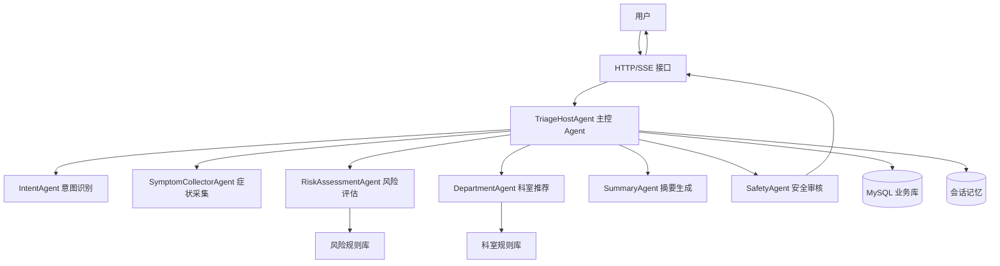
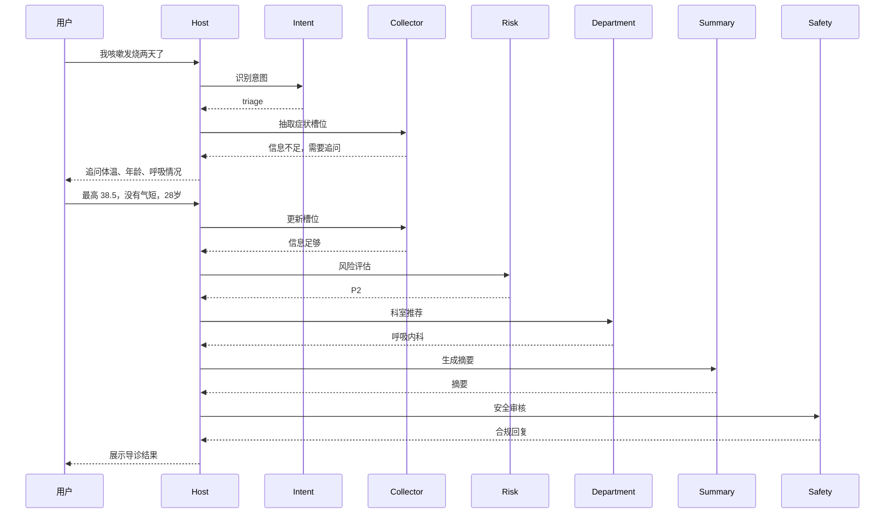
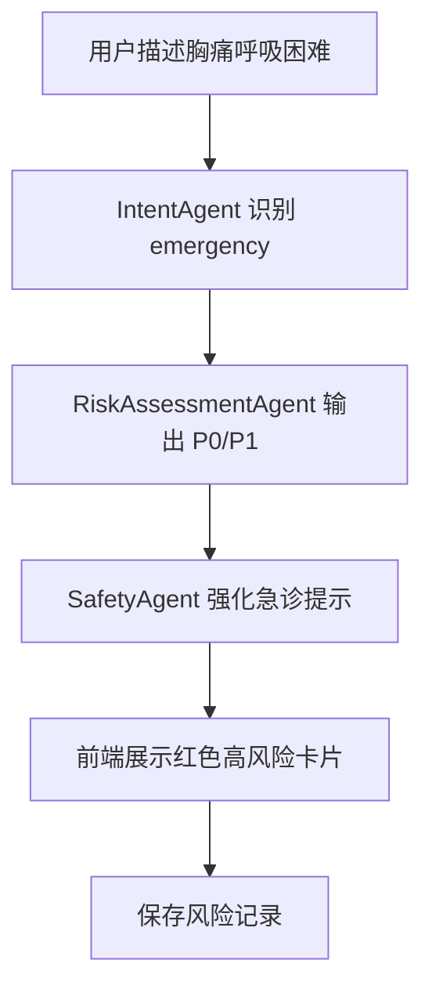

# 智能导诊多 Agent 架构设计

## 1. 架构目标

当前项目中的 `Mary` 是一个固定人设的单 Agent，适合用于演示聊天和记忆能力，但不适合承担完整智能导诊业务。

智能导诊需要拆分为多个专业 Agent，各 Agent 分别处理意图识别、症状采集、风险评估、科室推荐、摘要生成和安全审核，最终由主控 Agent 编排流程。

## 2. 总体架构



## 3. Agent 职责划分

### 3.1 TriageHostAgent

主控 Agent，负责流程编排，不直接承担所有业务判断。

职责：

- 接收用户消息和当前会话状态。
- 调用 IntentAgent 判断是否进入导诊流程。
- 调用 SymptomCollectorAgent 抽取槽位或生成追问。
- 调用 RiskAssessmentAgent 判断风险等级。
- 调用 DepartmentAgent 获取科室推荐。
- 调用 SummaryAgent 生成摘要。
- 调用 SafetyAgent 做最终回复审核。
- 决定是否继续追问、输出结果或提示急诊。

输入：

```json
{
  "session_id": "string",
  "user_message": "string",
  "known_slots": {},
  "history": []
}
```

输出：

```json
{
  "action": "ask_followup | show_result | emergency_alert | chitchat",
  "reply": "string",
  "structured_result": {}
}
```

### 3.2 IntentAgent

意图识别 Agent，判断用户当前消息属于哪类需求。

意图类型：

- `triage`：医疗导诊。
- `registration`：挂号咨询。
- `emergency`：明显急症。
- `chitchat`：闲聊。
- `unknown`：无法判断。

示例输出：

```json
{
  "intent": "triage",
  "confidence": 0.92,
  "reason": "用户描述咳嗽发热并询问挂什么科"
}
```

### 3.3 SymptomCollectorAgent

症状采集 Agent，负责把用户自然语言转换成结构化槽位，并判断是否需要追问。

核心槽位：

- `chief_complaint`：主诉。
- `symptom_location`：部位。
- `duration`：持续时间。
- `severity`：严重程度。
- `onset`：起病方式。
- `accompanying_symptoms`：伴随症状。
- `temperature`：体温。
- `age`：年龄。
- `gender`：性别。
- `pregnancy`：孕产相关。
- `medical_history`：既往史。
- `medication`：当前用药。
- `emergency_signs`：危急信号。

输出示例：

```json
{
  "slots": {
    "chief_complaint": "咳嗽、发热",
    "duration": "2天",
    "temperature": null,
    "emergency_signs": []
  },
  "missing_required_slots": ["temperature", "breathing_status", "age"],
  "followup_questions": [
    "最高体温是多少？",
    "有没有胸闷、气短或呼吸困难？",
    "方便告诉我年龄吗？"
  ],
  "is_enough_for_triage": false
}
```

### 3.4 RiskAssessmentAgent

风险评估 Agent，结合规则和模型判断当前是否存在高风险。

风险等级：

| 等级 | 名称 | 说明 |
|---|---|---|
| P0 | 紧急 | 立即急诊或拨打急救电话 |
| P1 | 高风险 | 尽快线下就医或急诊评估 |
| P2 | 中风险 | 建议预约对应科室门诊 |
| P3 | 低风险 | 可普通门诊或观察 |

输出示例：

```json
{
  "risk_level": "P1",
  "matched_rules": ["胸痛伴呼吸困难"],
  "reason": "胸痛合并呼吸困难属于潜在急症表现",
  "advice": "建议立即前往急诊或拨打急救电话"
}
```

### 3.5 DepartmentAgent

科室推荐 Agent，结合症状、风险等级和科室规则推荐就诊科室。

职责：

- 匹配症状关键词到科室。
- 给出首选科室和备选科室。
- 输出推荐理由。
- 输出就诊准备建议。

输出示例：

```json
{
  "primary_department": "呼吸内科",
  "alternative_departments": ["全科医学科", "耳鼻喉科"],
  "reason": "咳嗽、发热、咽痛优先考虑呼吸系统相关问题",
  "preparation": ["记录最高体温", "记录症状开始时间", "说明是否用过退烧药"]
}
```

### 3.6 SummaryAgent

摘要生成 Agent，把完整对话整理成医生或客服可快速阅读的摘要。

摘要结构：

```json
{
  "chief_complaint": "咳嗽、发热 2 天",
  "present_illness": "用户自述咳嗽伴发热，暂未提供最高体温",
  "positive_findings": ["咳嗽", "发热"],
  "negative_findings": ["暂未提及呼吸困难"],
  "risk_level": "P2",
  "recommended_department": "呼吸内科"
}
```

### 3.7 SafetyAgent

安全审核 Agent，负责最终回复合规化。

审核规则：

- 删除确定性诊断表达。
- 删除处方和具体剂量建议。
- 增加“不能替代医生诊断”的提示。
- 高风险时强化急诊提示。
- 保持语气清晰、稳妥、不过度恐吓。

## 4. 编排流程

### 4.1 普通导诊流程



### 4.2 高风险流程



## 5. 工具与规则

### 5.1 Agent 可调用工具

| 工具 | 用途 | 调用方 |
|---|---|---|
| DepartmentRuleTool | 查询科室规则 | DepartmentAgent |
| RiskRuleTool | 查询风险规则 | RiskAssessmentAgent |
| TriageRecordTool | 保存导诊记录 | TriageHostAgent |
| SessionMemoryTool | 查询会话记忆 | TriageHostAgent |
| SummarySaveTool | 保存摘要 | SummaryAgent |

### 5.2 规则优先级

- 明确高风险规则优先于普通科室推荐。
- 特殊人群风险加权优先于普通症状判断。
- 数据库规则优先于模型自由发挥。
- SafetyAgent 最终审核优先级最高。

## 6. 与当前代码的改造关系

当前代码位置：

`example/sse/main.go`

当前创建的是：

```text
agent.NewAgentBuilder(cm).
    WithName("mary").
    WithDescription("Mary 聊天助手").
    WithInstruction("你是一名28岁的厦门女孩...").
    WithMemory(globalMemoryProvider).
    Build(ctx)
```

后续改造方向：

1. 将页面标题从 Mary 改为智能导诊助手。
2. 将 Mary 人设 Prompt 替换为导诊主控 Prompt。
3. 新增 `triage` 模块承载业务逻辑。
4. 逐步从单 Agent 演进为主控 Agent + 子 Agent。
5. 先实现规则工具，再接入多 Agent 编排。

## 7. 分阶段落地计划

### 7.1 第一阶段：单 Agent 导诊 MVP

- 使用一个 TriageHostAgent 替代 Mary。
- Prompt 中加入导诊边界、安全规则和追问策略。
- 用简单规则函数完成风险和科室推荐。
- 前端展示导诊结果。

### 7.2 第二阶段：规则工具化

- 把科室规则和风险规则抽成工具。
- 增加业务表保存规则。
- 支持规则热更新。

### 7.3 第三阶段：多 Agent 编排

- 拆分 IntentAgent、SymptomCollectorAgent、RiskAssessmentAgent、DepartmentAgent、SummaryAgent、SafetyAgent。
- 主控 Agent 负责任务路由。
- 每个 Agent 输出结构化 JSON。

### 7.4 第四阶段：业务系统化

- 增加管理后台。
- 增加人工客服接管。
- 接入医院科室、医生排班和挂号系统。


