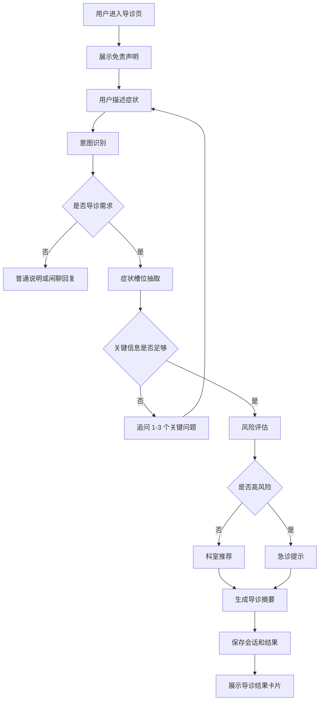

# 智能导诊系统 PRD

## 1. 文档信息

| 项目 | 内容 |
|---|---|
| 产品名称 | 智能导诊助手 |
| 项目代号 | smart-triage-agent |
| 当前阶段 | MVP 需求设计 |
| 目标用户 | 患者、导诊客服、医生、管理员 |
| 技术底座 | Go + Eino + MySQL + SSE + 多 Agent |

## 2. 项目背景

很多患者在就医前不知道应该挂哪个科，尤其是症状描述模糊、多个症状同时出现、或者存在潜在急症风险时，传统人工导诊效率低、重复问询多、记录不结构化。

本项目希望基于当前 AGGO Agent 框架，构建一个智能导诊助手，用对话方式采集患者症状，结合规则和大模型能力，给出初步科室建议、风险提示和就诊准备摘要。

系统定位是“导诊辅助工具”，不是“诊断工具”。所有输出都必须强调不能替代医生诊断。

## 3. 产品目标

### 3.1 核心目标

- 帮助患者根据症状快速找到可能适合的就诊科室。
- 引导患者补充关键症状信息，减少人工客服重复问询。
- 识别高风险症状，及时提示急诊或线下就医。
- 生成结构化导诊摘要，方便后续客服、医生或系统查看。
- 将导诊过程和结果沉淀到数据库，支持后续追踪和统计。

### 3.2 阶段目标

| 阶段 | 目标 | 说明 |
|---|---|---|
| MVP | 跑通导诊闭环 | 输入症状、追问、推荐科室、保存结果 |
| V1 | 增强业务能力 | 增加规则后台、历史会话、结果卡片 |
| V2 | 多 Agent 协作 | 完整主控 Agent + 子 Agent 编排 |
| V3 | 接入医院业务 | 科室排班、挂号、人工客服转接 |

## 4. 用户角色

### 4.1 患者

患者通过网页聊天界面描述自己的不适症状，系统引导补充年龄、性别、症状持续时间、严重程度、伴随症状等信息，最后得到推荐科室和就诊建议。

### 4.2 导诊客服

导诊客服查看患者导诊过程、AI 摘要、风险等级和科室推荐结果，必要时接管对话。

### 4.3 医生

医生查看导诊摘要，快速了解患者主诉、现病史、伴随症状、风险提示和推荐依据。

### 4.4 管理员

管理员维护科室、症状关键词、风险规则、系统提示词、模型配置、免责声明和业务开关。

## 5. 用户场景

### 5.1 不知道挂什么科

用户输入：“我最近咳嗽发烧两天了，应该挂什么科？”

系统需要识别为导诊需求，追问体温、是否胸闷气短、年龄等信息，然后推荐呼吸内科或全科医学科。

### 5.2 存在潜在急症

用户输入：“我胸口疼，还出汗，感觉喘不上气。”

系统需要识别为高风险，优先提示立即前往急诊或拨打急救电话，而不是继续普通分诊。

### 5.3 信息不足需要追问

用户输入：“我肚子疼。”

系统不能直接推荐科室，需要追问疼痛部位、持续时间、是否发热、是否呕吐腹泻、是否怀孕等信息。

### 5.4 普通咨询或闲聊

用户输入：“你是谁？”

系统应说明自己是智能导诊助手，可以帮助进行就医前导诊，不应该强行进入分诊流程。

## 6. 核心业务流程

## 7. 功能需求

### 7.1 患者导诊聊天

| 编号 | 功能 | 优先级 | 说明 |
|---|---|---|---|
| F-001 | 聊天式输入 | P0 | 用户可以输入症状描述 |
| F-002 | 流式回复 | P0 | 使用 SSE 展示 AI 回复过程 |
| F-003 | 开场免责声明 | P0 | 明确不是诊断，急症请及时就医 |
| F-004 | 多轮追问 | P0 | 信息不足时追问关键问题 |
| F-005 | 新建会话 | P1 | 用户可以重新开始导诊 |
| F-006 | 历史会话 | P2 | 用户可以查看历史导诊记录 |

### 7.2 症状采集

| 编号 | 功能 | 优先级 | 说明 |
|---|---|---|---|
| F-101 | 主诉识别 | P0 | 抽取用户最主要的不适 |
| F-102 | 持续时间识别 | P0 | 识别症状发生多久 |
| F-103 | 部位识别 | P0 | 识别疼痛或不适部位 |
| F-104 | 严重程度识别 | P1 | 轻微、中等、剧烈 |
| F-105 | 伴随症状识别 | P1 | 发热、呕吐、胸闷等 |
| F-106 | 特殊人群识别 | P1 | 儿童、老人、孕妇、慢病患者 |

### 7.3 风险评估

| 编号 | 功能 | 优先级 | 说明 |
|---|---|---|---|
| F-201 | 风险等级判断 | P0 | 输出 P0/P1/P2/P3 |
| F-202 | 急症规则命中 | P0 | 胸痛、呼吸困难、意识障碍等 |
| F-203 | 高风险提示 | P0 | 引导急诊或拨打急救电话 |
| F-204 | 特殊人群加权 | P1 | 对儿童、老人、孕妇提高风险等级 |

### 7.4 科室推荐

| 编号 | 功能 | 优先级 | 说明 |
|---|---|---|---|
| F-301 | 推荐首选科室 | P0 | 如呼吸内科、消化内科等 |
| F-302 | 推荐备选科室 | P1 | 信息不确定时给 1-2 个备选 |
| F-303 | 输出推荐理由 | P0 | 说明推荐依据 |
| F-304 | 就诊准备建议 | P1 | 提醒记录体温、用药、病程等 |

### 7.5 记录与摘要

| 编号 | 功能 | 优先级 | 说明 |
|---|---|---|---|
| F-401 | 保存会话消息 | P0 | 用户和助手消息入库 |
| F-402 | 保存分诊结果 | P0 | 风险等级、科室、理由入库 |
| F-403 | 生成导诊摘要 | P0 | 面向医生/客服的结构化摘要 |
| F-404 | 查询会话详情 | P1 | 通过 sessionId 获取完整记录 |

### 7.6 管理后台

| 编号 | 功能 | 优先级 | 说明 |
|---|---|---|---|
| F-501 | 科室规则管理 | P2 | 新增、编辑、停用科室规则 |
| F-502 | 风险规则管理 | P2 | 配置高风险症状规则 |
| F-503 | Agent 提示词管理 | P2 | 调整不同 Agent 的 Prompt |
| F-504 | 会话列表 | P2 | 管理端查看导诊记录 |

## 8. 非功能需求

### 8.1 安全合规

- 系统不得输出确定性诊断结论。
- 系统不得开处方或给出具体药物剂量。
- 高风险症状必须优先提示线下急诊。
- 涉及个人健康信息时，应考虑权限控制和脱敏展示。

### 8.2 可用性

- 普通消息响应应尽量在 3 秒内开始流式输出。
- 一次追问不超过 3 个问题，避免用户负担过重。
- 推荐结果需要结构化展示，不能只是一大段文字。

### 8.3 可维护性

- 科室规则和风险规则应独立于 Prompt 管理。
- Agent 职责要拆分清晰，避免一个 Agent 处理所有逻辑。
- 数据库业务表和记忆表分离。

## 9. MVP 验收标准

- 用户打开页面后看到“智能导诊助手”而不是 Mary。
- 用户输入症状后，系统能进行至少一轮有效追问。
- 系统能输出风险等级、推荐科室、推荐理由和就诊准备。
- 高风险症状能触发急诊提示。
- 会话消息和分诊结果能保存到 MySQL。
- GitHub 仓库有清晰的 PRD、架构设计、数据库设计文档。

## 10. 风险与限制

| 风险 | 说明 | 应对 |
|---|---|---|
| 医疗误导 | 模型可能输出过度诊断 | 增加 SafetyAgent 和规则约束 |
| 规则不足 | 初始科室规则覆盖不完整 | 从常见症状开始逐步补充 |
| 模型不稳定 | LLM 输出格式可能不一致 | 强制 JSON 输出并做解析兜底 |
| 隐私风险 | 会话包含健康敏感信息 | 后续增加脱敏、权限、审计 |
