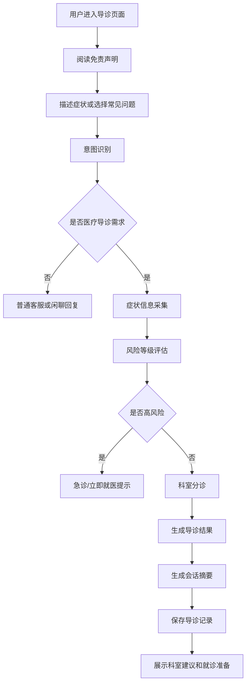
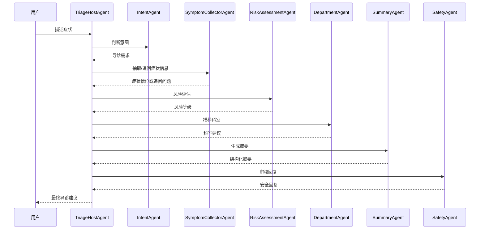

# 智能导诊系统产品与技术方案

## 1. 项目定位

本项目目标是把当前的单 Agent 聊天 Demo 升级为一个面向医院、诊所、互联网医疗平台的智能导诊系统。

系统不直接替代医生诊断，而是完成就医前的信息采集、风险提示、科室推荐、就诊准备建议和会话摘要，帮助患者更快找到合适科室，也帮助人工客服或医生减少重复问询。

### 1.1 核心价值

- 降低患者不知道挂什么科的问题。
- 在就诊前结构化采集症状、持续时间、部位、伴随症状、既往史等信息。
- 对高风险症状进行提醒，引导用户及时急诊或线下就医。
- 自动生成导诊摘要，方便医生、客服或后续系统查看。
- 沉淀导诊数据，为后续知识库、科室规则、排班推荐和运营分析做基础。

### 1.2 非目标

- 不做疾病确诊。
- 不给出处方、药物剂量、治疗方案。
- 不替代急诊、医生面诊或医疗机构正式意见。
- 不承诺分诊结果绝对准确。

## 2. 用户角色

### 2.1 患者用户

患者通过聊天界面描述不适，系统引导补充信息，最终给出建议科室、风险提示和就诊准备建议。

### 2.2 导诊客服

客服可查看患者会话摘要、分诊结果、风险等级和建议科室，在必要时接管对话。

### 2.3 医生或科室人员

医生可查看患者就诊前摘要，快速了解主诉、现病史、伴随症状和初步分诊依据。

### 2.4 管理员

管理员维护科室规则、常见症状词库、高风险规则、免责声明、模型配置、Agent 配置和系统提示词。

## 3. 核心业务流程



## 4. MVP 功能范围

第一阶段优先做一个可跑通的智能导诊闭环。

### 4.1 患者端

- 聊天式导诊入口。
- 开场免责声明。
- 症状描述输入。
- Agent 自动追问关键信息。
- 展示推荐科室、风险等级、建议行动。
- 展示就诊前准备建议。
- 支持新建会话和历史会话查看。

### 4.2 Agent 能力

- 判断用户是否在问导诊相关问题。
- 识别主诉、症状、持续时间、部位、严重程度、伴随症状。
- 对缺失信息进行追问。
- 根据规则和模型推理推荐科室。
- 对胸痛、呼吸困难、意识障碍、严重外伤、剧烈腹痛、孕产急症等高风险情况做安全提示。
- 生成结构化导诊摘要。

### 4.3 管理能力

- 科室配置。
- 常见症状到科室的映射规则。
- 高风险规则配置。
- Agent 提示词配置。
- 分诊记录查询。

## 5. 多 Agent 设计

当前 `Mary` 是单 Agent，适合作为前台接待角色。智能导诊建议改为主控 Agent + 专业子 Agent 的结构。

### 5.1 Agent 列表

| Agent | 职责 | 输入 | 输出 |
|---|---|---|---|
| TriageHostAgent | 主控和流程编排 | 用户消息、会话状态 | 下一步动作、调用哪个 Agent |
| IntentAgent | 意图识别 | 用户消息 | 是否导诊、是否闲聊、是否挂号、是否紧急 |
| SymptomCollectorAgent | 症状采集 | 用户描述、已知槽位 | 缺失问题、结构化症状 |
| RiskAssessmentAgent | 风险评估 | 结构化症状 | 风险等级、急诊提示 |
| DepartmentAgent | 科室推荐 | 症状、规则、风险等级 | 推荐科室、备选科室、理由 |
| SummaryAgent | 摘要生成 | 完整会话、结构化信息 | 导诊摘要、医生视角摘要 |
| SafetyAgent | 医疗安全审核 | 最终回复 | 合规改写、免责声明、风险提示 |

### 5.2 推荐调用顺序



### 5.3 Mary 的定位调整

原来的 Mary 不建议继续承担全部业务判断。可以改成：

- 前台接待 Agent。
- 负责自然语言交流、安抚用户、引导用户补充信息。
- 不直接做最终诊断。
- 遇到医疗导诊问题时，把任务交给导诊主控 Agent。

## 6. 症状采集槽位

导诊对话需要把自然语言转换成结构化信息。

| 字段 | 说明 | 示例 |
|---|---|---|
| chief_complaint | 主诉 | 发烧、咳嗽、腹痛 |
| symptom_location | 部位 | 左胸、右下腹、咽喉 |
| duration | 持续时间 | 2小时、3天、半个月 |
| severity | 严重程度 | 轻微、中等、剧烈 |
| onset | 起病方式 | 突然、逐渐、反复 |
| accompanying_symptoms | 伴随症状 | 恶心、呕吐、胸闷 |
| temperature | 体温 | 38.5℃ |
| age | 年龄 | 28岁 |
| gender | 性别 | 男、女 |
| pregnancy | 是否孕产相关 | 怀孕、产后 |
| medical_history | 既往史 | 高血压、糖尿病 |
| allergy_history | 过敏史 | 青霉素过敏 |
| medication | 当前用药 | 布洛芬、降压药 |
| emergency_signs | 危急信号 | 呼吸困难、意识模糊 |

## 7. 风险等级设计

### 7.1 风险等级

| 等级 | 名称 | 处理建议 |
|---|---|---|
| P0 | 紧急 | 立即拨打急救电话或前往急诊 |
| P1 | 高风险 | 建议尽快线下就医或急诊评估 |
| P2 | 中风险 | 建议尽快预约对应科室 |
| P3 | 低风险 | 可先观察，必要时普通门诊 |

### 7.2 高风险规则示例

- 胸痛伴呼吸困难、出冷汗、放射痛。
- 突发意识障碍、言语不清、肢体无力。
- 严重外伤、大出血、骨折疑似。
- 剧烈头痛伴呕吐、抽搐、意识改变。
- 高热不退，尤其儿童、老人、孕妇、免疫低下人群。
- 剧烈腹痛、腹部板硬、呕血、黑便。
- 孕期腹痛、阴道出血、胎动异常。
- 过敏后出现喉头紧、呼吸困难、全身皮疹。

## 8. 科室推荐规则

第一阶段可用规则 + LLM 混合方式，不建议完全靠模型自由判断。

### 8.1 基础科室

- 呼吸内科：咳嗽、咳痰、气喘、肺部不适。
- 消化内科：腹痛、腹泻、恶心、呕吐、胃痛。
- 心血管内科：胸痛、心悸、血压异常。
- 神经内科：头痛、头晕、肢体麻木、言语不清。
- 骨科：关节痛、骨折、腰腿痛、外伤后活动受限。
- 皮肤科：皮疹、瘙痒、红肿、皮肤感染。
- 耳鼻喉科：咽痛、鼻塞、耳痛、听力下降。
- 眼科：眼痛、视物模糊、红眼。
- 妇产科：月经异常、孕产相关、下腹痛。
- 儿科：儿童发热、咳嗽、腹泻等。
- 急诊科：高风险症状、急性严重不适。

### 8.2 推荐结果结构

```json
{
  "risk_level": "P2",
  "primary_department": "呼吸内科",
  "alternative_departments": ["全科医学科", "耳鼻喉科"],
  "reason": "用户主要表现为咳嗽、咽痛、发热 2 天，优先考虑呼吸系统相关问题。",
  "suggested_questions": ["是否有胸闷气短？", "体温最高多少？"],
  "next_action": "建议预约呼吸内科门诊，如出现呼吸困难或持续高热请及时急诊。"
}
```

## 9. 数据库设计

建议不要只依赖 memory 表，业务数据单独建表。

### 9.1 triage_session

导诊会话表。

| 字段 | 类型 | 说明 |
|---|---|---|
| id | bigint/string | 主键 |
| session_id | varchar | 会话 ID |
| user_id | varchar | 用户 ID |
| status | varchar | active/completed/transferred |
| risk_level | varchar | P0/P1/P2/P3 |
| primary_department | varchar | 推荐科室 |
| summary | text | 导诊摘要 |
| created_at | datetime | 创建时间 |
| updated_at | datetime | 更新时间 |

### 9.2 triage_message

会话消息表。

| 字段 | 类型 | 说明 |
|---|---|---|
| id | bigint/string | 主键 |
| session_id | varchar | 会话 ID |
| role | varchar | user/assistant/system/tool |
| content | text | 消息内容 |
| structured_data | json | 抽取后的结构化信息 |
| created_at | datetime | 创建时间 |

### 9.3 triage_result

分诊结果表。

| 字段 | 类型 | 说明 |
|---|---|---|
| id | bigint/string | 主键 |
| session_id | varchar | 会话 ID |
| risk_level | varchar | 风险等级 |
| primary_department | varchar | 首选科室 |
| alternative_departments | json | 备选科室 |
| reason | text | 推荐理由 |
| next_action | text | 下一步建议 |
| safety_notice | text | 安全提示 |
| created_at | datetime | 创建时间 |

### 9.4 department_rule

科室规则表。

| 字段 | 类型 | 说明 |
|---|---|---|
| id | bigint/string | 主键 |
| department | varchar | 科室名称 |
| keywords | json | 症状关键词 |
| exclude_keywords | json | 排除关键词 |
| priority | int | 优先级 |
| enabled | bool | 是否启用 |
| created_at | datetime | 创建时间 |
| updated_at | datetime | 更新时间 |

### 9.5 risk_rule

风险规则表。

| 字段 | 类型 | 说明 |
|---|---|---|
| id | bigint/string | 主键 |
| name | varchar | 规则名称 |
| symptoms | json | 命中症状 |
| population | json | 特殊人群 |
| risk_level | varchar | 风险等级 |
| advice | text | 处理建议 |
| enabled | bool | 是否启用 |

## 10. 后端接口规划

### 10.1 聊天流式接口

`POST /api/triage/chat`

请求：

```json
{
  "sessionId": "optional-session-id",
  "message": "我咳嗽发烧两天了",
  "userId": "user-001"
}
```

响应：SSE 流式返回文本和结构化事件。

事件类型：

- `message_delta`：回复增量。
- `question`：追问问题。
- `triage_result`：分诊结果。
- `risk_alert`：风险提示。
- `done`：完成。

### 10.2 获取会话详情

`GET /api/triage/sessions/{sessionId}`

返回会话消息、分诊结果、摘要。

### 10.3 获取历史会话

`GET /api/triage/sessions?userId=xxx`

返回用户历史导诊记录。

### 10.4 管理科室规则

- `GET /api/admin/department-rules`
- `POST /api/admin/department-rules`
- `PUT /api/admin/department-rules/{id}`
- `DELETE /api/admin/department-rules/{id}`

### 10.5 管理风险规则

- `GET /api/admin/risk-rules`
- `POST /api/admin/risk-rules`
- `PUT /api/admin/risk-rules/{id}`
- `DELETE /api/admin/risk-rules/{id}`

## 11. 前端页面规划

### 11.1 患者导诊页

- 左侧或顶部展示系统名称和免责声明。
- 中间为聊天窗口。
- 输入框支持多行输入。
- 结果区展示推荐科室卡片。
- 高风险时展示醒目的急诊提示。
- 可点击“重新导诊”“转人工”“查看摘要”。

### 11.2 导诊结果卡片

卡片内容：

- 风险等级。
- 推荐科室。
- 备选科室。
- 推荐理由。
- 就诊准备。
- 需要立刻就医的情况。

### 11.3 管理后台

- 会话列表。
- 会话详情。
- 科室规则管理。
- 风险规则管理。
- Agent 提示词管理。
- 模型配置和运行状态。

## 12. 安全与合规要求

所有回复需要遵守以下原则：

- 明确说明系统仅提供导诊建议，不构成诊断。
- 不输出确定性诊断，例如“你就是某某病”。
- 不输出处方和具体药物剂量。
- 对高风险症状优先提示急诊或拨打急救电话。
- 对儿童、老人、孕妇、慢病患者等特殊人群提高风险等级。
- 避免制造恐慌，语气应稳妥、清晰、可执行。
- 保存敏感信息时需要考虑脱敏、权限和审计。

## 13. 技术实现建议

### 13.1 项目模块建议

```text
triage/
  agent/              # 多 Agent 定义和编排
  service/            # 导诊业务服务
  repository/         # 数据库存取
  model/              # 业务结构体
  rule/               # 科室规则和风险规则
  prompt/             # Agent 提示词
  api/                # HTTP 接口
```

### 13.2 推荐开发顺序

1. 保留现有 SSE 页面，改造成导诊页面。
2. 新增导诊结构体：症状、风险、科室推荐、摘要。
3. 新增规则引擎：先用关键词规则实现科室推荐和风险识别。
4. 新增 TriageHostAgent，负责流程控制。
5. 新增 SymptomCollectorAgent，负责抽取和追问。
6. 新增 DepartmentAgent，负责科室推荐。
7. 新增 SummaryAgent，负责摘要。
8. 新增业务表保存分诊记录。
9. 前端展示分诊结果卡片。
10. 再逐步增加后台管理能力。

## 14. 第一阶段开发 TODO

### 后端

- [ ] 新建 `triage` 业务模块。
- [ ] 定义 `TriageSession`、`TriageMessage`、`TriageResult` 结构体。
- [ ] 实现 `POST /api/triage/chat`。
- [ ] 实现基础风险规则。
- [ ] 实现基础科室推荐规则。
- [ ] 实现症状信息抽取 Prompt。
- [ ] 实现分诊结果 JSON 输出。
- [ ] 保存会话消息和分诊结果到 MySQL。

### 前端

- [ ] 把标题从 Mary 改成智能导诊助手。
- [ ] 增加免责声明区域。
- [ ] 增加常见症状快捷入口。
- [ ] 增加分诊结果卡片。
- [ ] 高风险结果用红色警示样式。
- [ ] 增加新建会话按钮。

### 业务配置

- [ ] 初始化常见科室。
- [ ] 初始化症状关键词规则。
- [ ] 初始化高风险规则。
- [ ] 初始化安全提示词。

## 15. 示例导诊话术

### 15.1 开场

你好，我是智能导诊助手。我可以帮你根据症状初步判断可能适合就诊的科室，并整理一份就诊前摘要。这里的建议不能替代医生诊断；如果你出现胸痛、呼吸困难、意识不清、大出血、剧烈疼痛等情况，请立即前往急诊或拨打急救电话。

### 15.2 追问

为了更准确地推荐科室，我想再确认几个问题：

1. 这个症状持续多久了？
2. 有没有发热、胸闷、呼吸困难、呕吐或剧烈疼痛？
3. 你的年龄和性别方便告知吗？

### 15.3 输出结果

根据你目前描述的信息，我建议优先考虑：呼吸内科。

推荐理由：你主要描述了咳嗽、发热、咽痛，持续 2 天，比较符合呼吸系统相关问题的就诊范围。

风险提示：如果出现呼吸困难、胸痛、持续高热不退、精神状态明显变差，请及时前往急诊。

就诊准备：建议记录最高体温、症状开始时间、是否用过药、是否接触过感冒或流感患者，方便医生判断。

## 16. 当前项目改造结论

当前项目已经具备模型调用、SSE 流式响应、内存/数据库记忆和简单 Web UI，适合作为智能导诊系统的技术底座。

但业务上仍需要补充：多 Agent 分工、导诊流程、风险规则、科室规则、业务数据库、前端结果卡片和安全合规提示。

建议先不要一次性追求完整医院系统，而是先做一个 MVP：用户描述症状，系统追问 1-3 个问题，输出风险等级、推荐科室、理由和就诊准备，并保存导诊记录。
