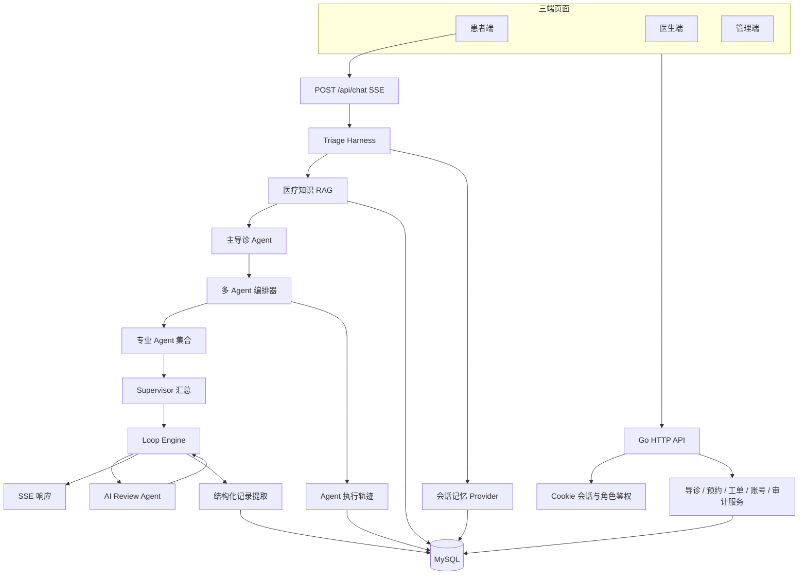
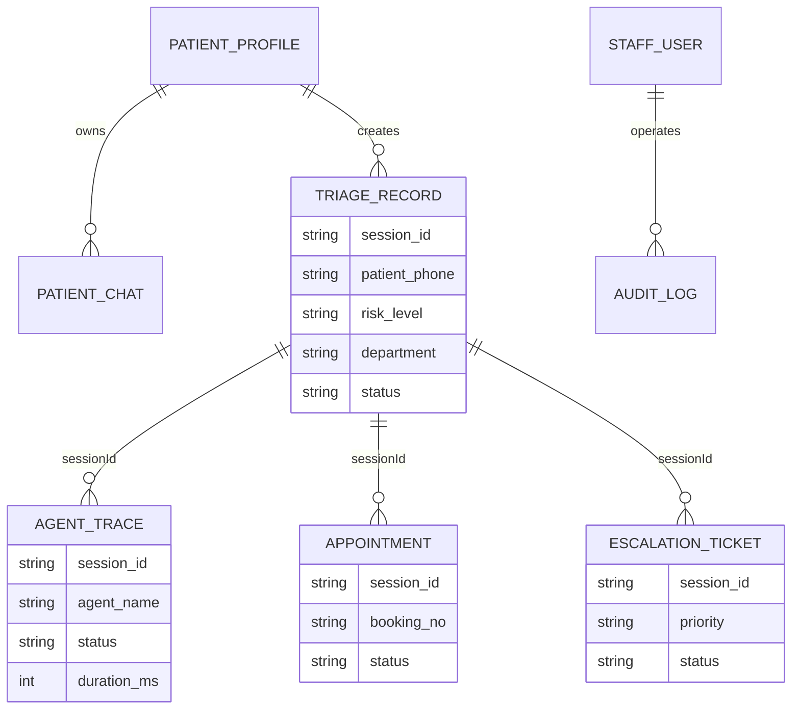

# 多 Agent 智能导诊平台技术说明

## 1. 文档目的

本文档说明多 Agent 智能导诊平台的工程实现，包括总体架构、数据模型、多 Agent 编排、检索增强生成（RAG）能力、SSE 流式通信、权限安全与运行保障。本文以当前仓库中已实现的代码为准，并明确区分“已接入能力”和“可扩展能力”。

> **系统边界：** 平台用于就医前分诊辅助、风险提示和业务协同，不做疾病确诊，不开具处方，不替代医生面诊、急诊服务或医疗机构正式意见。

## 2. 技术栈与工程形态

| 层级 | 实现 |
| --- | --- |
| 后端服务 | Go 标准库 `net/http`，单体 HTTP 服务 |
| Agent 框架 | AGGO + CloudWeGo Eino ADK |
| 模型接入 | OpenAI 兼容 API；通过 `BaseUrl`、`APIKey`、`Model` 配置 |
| 流式协议 | SSE（Server-Sent Events），响应格式兼容 OpenAI 流式数据结构 |
| 数据持久化 | MySQL + GORM `AutoMigrate` |
| 会话记忆 | AGGO builtin memory + GORM Storage |
| 前端交付 | 嵌入式 HTML 页面，患者端、医生端、管理端分离 |
| 外部能力 | 百度地图 JavaScript API GL、短信服务适配、PDF 生成 |

应用入口位于 `example/sse/main.go`。服务启动时依次加载环境变量、初始化模型、连接 MySQL、自动迁移业务表、初始化风险规则、公开医疗知识和账号、创建记忆 Provider、构建主导诊 Agent、结构化提取 Agent、AI Review Agent 与多个专业 Agent，最后注册 HTTP 路由并监听端口。一次导诊运行由 `TriageHarness` 统一管理，内部通过有界 Loop Engine 驱动审核收敛。

## 3. 总体架构



架构采用“同步回答、异步落库”的策略：Triage Harness 先完成医疗知识检索、主导诊、多 Agent 协作和 AI Review 收敛，再通过 SSE 返回结果；结构化导诊记录的提取与保存则在响应完成后异步执行。
## 4. 分层设计

### 4.1 接入与展示层

- 患者端负责验证码登录、健康档案、会话历史、导诊、报告、预约和地图交互。
- 医生端负责查看待处理患者、风险报告、人工复核、协同诊断、急诊通道、预约处置和随访任务闭环。
- 管理端负责导诊分析、Agent 轨迹、人工复核 SLA、预约监控、风险规则、账号权限、平台配置与审计。
- 所有页面嵌入 `example/sse/web/`，再由 `example/sse/pages.go` 编译进服务程序，部署时无需单独启动前端服务。

### 4.2 API 与鉴权层

后端基于 `net/http` 注册路由。患者、医生和管理员各自使用独立 Cookie 会话；受保护接口在业务处理前验证会话和角色。

| 角色 | 典型接口 | 鉴权目标 |
| --- | --- | --- |
| 患者 | `/api/patient/me`、`/api/patient/profile`、`/api/patient/chats`、`/api/chat`、`/api/appointments` | 仅能访问自己的档案、会话、记录、工单和预约 |
| 医生 | `/api/doctor/me`、导诊记录状态、工单与预约处理 | 查看临床队列并执行允许的状态流转 |
| 管理员 | `/api/admin/records`、`/api/admin/agent-traces`、`/api/admin/platform-config` 等 | 管理平台、规则、账号、审计与运营数据 |

医生账号由 `staff_users` 统一管理，密码使用 bcrypt 哈希。停用医生或重置医生密码时，会撤销该用户名对应的内存会话，避免旧 Cookie 继续访问。

### 4.3 业务服务层

业务服务按领域拆分：

- `triage_records.go`：导诊记录、风险等级与医生处理状态。
- `patient_services.go`：患者档案、验证码、预约、地图、PDF。
- `patient_chats.go`：持久化会话与历史对话。
- `escalation_tickets.go`：人工复核工单及状态流转。
- `risk_rules.go`：风险规则配置与审计。
- `staff_accounts.go`、`admin.go`：员工账号、平台配置、管理端查询与审计。
- `multi_agent.go`：专业 Agent 调度、汇总与轨迹记录。
- `extraction_agent.go`：从对话中提取结构化导诊记录。

## 5. Harness、Loop Engine 与多 Agent 编排逻辑

### 5.1 Triage Harness

`TriageHarness` 是一次导诊运行的总控容器。HTTP Handler 只负责请求校验、患者身份、`sessionId` 与 SSE 输出；Harness 持有并传递患者档案上下文、RAG 命中、主导诊草稿、专家结果和最终回答，保证各节点共享同一会话状态。

固定阶段为：`Context -> RAG -> Main Agent -> Dispatcher -> Specialists -> Supervisor -> AI Review Loop -> Response -> Async Extraction`。任一非关键节点失败时按阶段降级，不允许绕过安全审核直接输出不受控内容。

### 5.2 Loop Engine 与 AI Review

Loop Engine 以候选回答为循环状态，调用独立 AI Review Agent 检查上下文承接、急症遗漏、过度诊断、用药越界、特殊人群安全和表达质量。当前最大循环次数为 2：

1. Review 通过时立即收敛并输出。
2. Review 不通过时采用修正稿作为下一轮候选回答。
3. 第二轮仍未明确通过时输出最后一版保守修正稿，轨迹标记为 `corrected_max_rounds`。
4. Review 异常时保留 Supervisor 候选回答并记录 `degraded`，避免无限等待。

每轮写入 `agent_traces`，Agent 名称为 `ai-review`，状态包括 `approved`、`corrected`、`corrected_max_rounds` 和 `degraded`。有界循环既提供自我修正能力，也避免无限 Agent 循环造成延迟和成本失控。

### 5.3 Agent 角色

| Agent / 组件 | 职责 | 输出重点 |
| --- | --- | --- |
| 主导诊 Agent（`main-triage`） | 根据档案、会话与 RAG 证据生成基础草稿 | 追问、初步建议、患者可读文本 |
| Medical Knowledge RAG | 检索公开可追溯分诊知识 | Top 3 知识、来源与得分 |
| Intent Agent | 判断当前消息意图 | 导诊、用药、报告、急症、复诊或其他 |
| History Agent | 汇总已知病史并识别缺失信息 | 病史摘要、一个必要追问 |
| Risk Agent | 独立判断风险 | `P1` / `P2` / `P3`、依据与安全提醒 |
| Department Agent | 推荐科室 | 首选科室、推荐依据 |
| Medication Agent | 按需检查用药和特殊人群风险 | 用药安全提醒、必要追问 |
| Emergency Agent | 按需判断急诊优先级 | 常规、尽快门诊、急诊、拨打 120 |
| Supervisor Agent | 汇总草稿、RAG 和专家结果 | 最终候选回答、冲突消解 |
| AI Review Agent | 审核并必要时修正候选回答 | 通过、修正稿、审核原因 |
| Extractor Agent | 异步生成结构化业务记录 | 症状、风险、科室、依据、准备事项、警示 |

### 5.4 调度、并发与降级

编排器先运行 Intent Agent，再选择风险、科室和病史等基础节点；涉及用药或特殊人群时增加 Medication Agent，出现胸痛、呼吸困难、昏迷、大出血等高危词时增加 Emergency Agent。专业节点输出统一 JSON。容量为 2 的通道限制同轮并发，避免模型调用失控。

主导诊失败会重试一次，仍失败则使用保守回退回答；Supervisor 失败回退主导诊草稿；AI Review 失败保留候选回答。RAG、主导诊、调度器、专业节点、人工升级、Supervisor 和每轮 AI Review 均保存耗时、状态、摘要与错误。
## 6. 数据库设计与数据关联

### 6.1 数据表分组

数据库通过 GORM `AutoMigrate` 在启动期同步结构，主要分为以下几类。

| 分组 | 主要表 | 用途 |
| --- | --- | --- |
| 患者与会话 | `patient_profiles`、`patient_chats` | 患者基础档案、会话元数据与聊天历史 |
| 导诊核心 | `triage_records`、`agent_traces` | 结构化导诊结果和执行可观测性 |
| 协同处理 | `appointments`、`escalation_tickets` | 预约挂号、人工复核与医生协同 |
| 平台治理 | `staff_users`、`risk_rules`、`audit_logs`、`platform_configs` | 账号权限、规则、管理操作审计和平台配置 |
| 框架记忆 | AGGO builtin memory 的 GORM 存储表 | 对话上下文记忆，不与业务结果混为一表 |

### 6.2 核心实体

**患者档案 `patient_profiles`**

以手机号作为唯一标识，保存姓名、性别、年龄、身高体重、血型、慢病、药物过敏、既往史、生命体征和紧急联系人等。AI 上下文只取与分诊相关的健康字段，不将紧急联系人直接发送给模型。

**导诊记录 `triage_records`**

记录 `sessionId`、患者手机号、档案快照、症状摘要、风险等级、风险文本、推荐科室、备选科室、依据、就诊准备、警示、医生备注和处理状态。对于同一 `sessionId`，保存逻辑采用更新式写入，避免因异步提取重复产生多条主记录。

**Agent 轨迹 `agent_traces`**

记录 `sessionId`、患者手机号、Agent 名称、执行状态、耗时毫秒、结果摘要、错误文本和创建时间。它既用于管理端观察编排链路，也用于人工复核时回看模型执行情况。

**预约 `appointments` 与人工复核 `escalation_tickets`**

预约保存预约号、医院、科室、预约时间和状态；人工复核保存原因、优先级、状态、分配医生、医生回复及时间节点。两者均保存 `sessionId`，可回溯到对应导诊记录和 Agent 轨迹。

**治理表**

- `staff_users`：用户名、bcrypt 密码哈希、显示名称、角色、科室、启停状态和登录时间。
- `risk_rules`：规则编码、名称、描述、风险级别、关键词和启停状态。
- `audit_logs`：管理员或系统的敏感操作记录。
- `platform_configs`：服务名称、默认语言、会话保留天数和告警级别等平台参数。

### 6.3 关键关联



`sessionId` 是导诊业务闭环的主关联键：一轮患者导诊可关联一条主导诊记录、多条 Agent 轨迹、零到多条预约记录和零到多条人工复核记录。患者手机号用于数据归属和权限过滤，但不替代会话级关联。

## 7. RAG 与会话检索逻辑

### 7.1 双检索结构

导诊链路已启用两类检索增强：

- **会话记忆检索**：AGGO builtin memory 使用 `RetrievalLastN`，最多检索最近 8 条消息，用于多轮上下文和结构化记录提取。
- **医疗知识 RAG**：启动时将审核过的公开分诊资料写入 `medical_knowledge_documents`；每次 `POST /api/chat` 都先按患者主诉和健康档案检索，再把 Top 3 命中注入主导诊、专业 Agent、Supervisor 和 AI Review。

### 7.2 医疗知识来源与边界

初始知识覆盖胸痛/呼吸困难、脑卒中警示、大出血与意识异常、发热特殊人群、呼吸道症状、腹痛和用药过敏安全，并包含一个去标识化教学问诊场景。来源使用 MedlinePlus 和 WHO 公开页面，每条知识保存编码、标题、内容、关键词、来源名称和 URL。

知识仅提供分诊和安全边界，不用于疾病确诊、处方或个体化剂量。高风险场景不能因 RAG 未命中而降低急诊等级；Risk Agent 与 Emergency Agent 仍独立工作。
初始种子资料如下：

| 主题 | 来源 |
| --- | --- |
| 胸痛与呼吸困难 | MedlinePlus：`https://medlineplus.gov/chestpain.html` |
| 卒中警示 | MedlinePlus：`https://medlineplus.gov/stroke.html` |
| 大出血、意识异常与抽搐 | MedlinePlus：`https://medlineplus.gov/ency/article/000045.htm` |
| 发热与特殊人群 | MedlinePlus：`https://medlineplus.gov/fever.html` |
| 呼吸道症状 | WHO：`https://www.who.int/health-topics/respiratory-tract-diseases` |
| 腹痛 | MedlinePlus：`https://medlineplus.gov/abdominalpain.html` |
| 用药与过敏安全 | MedlinePlus：`https://medlineplus.gov/drugsafety.html` |


### 7.3 检索实现

当前采用本地可审计的关键词加权检索，不依赖额外向量服务或付费 Embedding：规范化中英文和标点；关键词精确命中高权重；标题正文命中增加得分；胸痛、卒中、出血、发热、腹痛、用药等安全信号额外加权；最终按分数取 Top 3，并把来源一起放入 `<medical_knowledge_references>`。

每次检索写入 `agent_traces`，Agent 名称为 `medical-knowledge-rag`，状态为 `completed` 或 `no_match`，摘要包含命中文档、来源和分数。
验收时应针对胸痛/呼吸困难、卒中、发热、腹痛、用药过敏等主诉检查：对应会话的轨迹中存在 `medical-knowledge-rag`，命中时摘要包含知识编码与来源；后续存在 `supervisor` 和 `ai-review` 轨迹。这样可以同时验证 RAG、Harness 和 Loop Engine 已进入真实导诊链路。

### 7.4 知识审核与版本治理

医疗知识通过管理端“风险规则”页面中的知识审核区运营。新建知识默认为 `pending` 且不启用；管理员可通过或驳回。只有 `review_status = approved` 且 `enabled = true` 的条目会进入 RAG 检索。已审核条目编辑后版本号递增、状态回到待审核并自动停用，防止未经复核的更新直接进入导诊链路。

每条知识保存 `version`、`reviewedBy`、`reviewedAt`、来源名称和来源 URL，审核、驳回、启停和更新操作均进入管理员审计日志。

### 7.5 向量 RAG 扩展

AGGO 底座保留 Milvus、PostgreSQL + pgvector、`indexer.Indexer`、`retriever.Retriever` 与 `tools/knowledge`。知识规模扩大后，可在不改变 Harness 阶段的前提下替换为“关键词召回 + 向量召回 + 元数据过滤 + 重排”的混合检索。医疗知识必须保留来源、版本、审核状态和失效策略。
## 8. SSE 流式通信设计

### 8.1 为什么使用 SSE

导诊回答需要让浏览器在一个 HTTP 请求中持续获得输出，同时实现成本低、兼容常规 HTTP 基础设施。系统选用 SSE：服务端单向向客户端推送事件，客户端仍通过普通 `POST /api/chat` 提交消息。

### 8.2 服务端处理流程

`chatHandler` 在处理请求时：

1. 设置 `Content-Type: text/event-stream; charset=utf-8`、`Cache-Control: no-cache` 和 `Connection: keep-alive`。
2. 校验 HTTP 方法、JSON 请求体、患者会话和非空消息。
3. 生成或复用 `sessionId`，并在响应头 `X-Session-ID` 返回给前端。
4. 使用 `sse.NewWriter(sessionID, w)` 包装响应对象；若底层不支持 `http.Flusher`，直接拒绝流式请求。
5. 完成 Agent 编排后，将最终文本转换为 OpenAI 风格流式响应 JSON，并通过 `WriteJSONData` 写出。
6. 调用 `WriteDone` 发送 `data: [DONE]\n\n`，通知前端本轮结束。
7. 结束后异步提取并保存导诊记录。

### 8.3 Writer 设计

`pkg/sse.Writer` 封装 SSE 事件格式化、写入和刷新：

- `WriteEvent`、`WriteData`、`WriteJSONData` 负责生成 `data:` 格式事件。
- 每次成功写入后调用 `http.Flusher.Flush()`，降低缓冲导致的前端等待。
- `WriteKeepAlive` 支持注释型保活事件。
- `WriteDone` 统一发送 `[DONE]` 结束标记。
- `Stream` 支持直接消费 Eino 的流式 `StreamReader`，逐块 JSON 编码并发送；当前导诊接口在完成编排后以最终结果写出，但底座已具备逐 chunk 转发能力。

### 8.4 异常与连接处理

- 若客户端断开导致写入失败，Writer 标记关闭并停止继续写入。
- `Stream` 检查请求上下文取消状态和 Writer 关闭状态。
- 模型和编排失败通过降级结果返回，避免 SSE 长时间无响应。
- 业务数据落库在 SSE 完成后异步执行，因此网络中断不应阻断已完成的关键编排和轨迹记录；需要在生产部署中补充任务队列或重试机制以增强最终一致性。

## 9. 人工复核 SLA 与自动升级

人工复核工单在后端持久化 `slaDeadline`、`overdue`、`escalationCount`、`lastEscalatedAt` 和 `escalationReason`。P1 默认 10 分钟、P2 默认 30 分钟、P3 默认 2 小时。工单在医生、管理员或患者查询时刷新 SLA：未关闭工单超过截止时间后标记为超时，并记录首次自动升级。管理端人工复核页直接展示后端截止时间和升级次数，不再只依赖浏览器临时计算。

工单仍使用受限状态流转：`pending -> accepted -> replied -> closed`，回复前必须接单，关闭后不参与 SLA 超时刷新。

## 10. 安全、可观测性与可靠性

### 10.1 安全控制

- 三类 Cookie 会话隔离：患者、医生、管理员使用不同会话键。
- 业务接口按身份过滤数据，匿名请求返回 `401`。
- 密码仅保存 bcrypt 哈希；配置中的真实密钥和密码不应进入版本控制。
- `BaseUrl`、`APIKey` 和 `MYSQL_DSN` 在所有环境中必须显式配置，系统不再内置默认数据库账号或密码。
- `APP_ENV=production` 时集中校验医生与管理员账号、至少 12 位的非演示密码、百度地图 AK 和短信服务配置；校验失败时拒绝启动。
- 生产短信必须配置互亿无线账号密码，或提供自定义 `SMS_PROVIDER_URL`。开发环境返回的本地 `debugCode` 不得在生产模式启用。
- 患者验证码设置过期时间和错误次数限制。
- 健康档案中的紧急联系人不进入 AI 上下文。
- 管理员配置接口不保存模型密钥、数据库密码和百度地图 AK。

### 10.2 可观测性

- Agent 轨迹保存名称、状态、耗时、摘要和错误文本，管理端支持按会话、Agent 和状态查询。
- 管理端审计记录账号、规则、配置、密码重置等平台操作。
- 导诊记录、预约、工单与轨迹可依据 `sessionId` 进行链路追踪。

### 10.3 可靠性与后续建议

当前系统已实现模型重试、结果降级、并发限制和结构化轨迹。若进入生产环境，建议进一步增加：

- 将异步提取、短信发送、PDF 生成等任务迁移到可靠队列并支持幂等重试。
- 为模型调用设置细粒度超时、熔断、限流、成本预算和告警。
- 使用 Redis 或数据库替代进程内会话存储，以支持多实例部署和重启恢复。
- 对敏感健康数据执行传输加密、字段加密或脱敏、访问留痕和数据保留策略。
- 引入经过审核的医学知识库 RAG，并保留来源、版本和命中证据。

## 11. 业务完整性与剩余缺口

当前已经形成可运行的导诊闭环：患者身份与档案、多轮导诊、强制 RAG、多 Agent 风险与科室分析、AI Review、结构化报告、人工复核、预约、医生处置、管理端轨迹与审计均已贯通。

如果定位为课程、毕业设计或内部原型，核心业务已经完整。若要作为真实医院生产系统上线，仍需补充：

- 接入真实 HIS/EMR、科室排班、号源和支付，而不是本地模拟预约。
- 建立由执业医师审核的知识入库、版本、下线和证据追踪流程。
- 对模型与规则执行临床验证、风险分层评估、回归集和红队测试。
- 使用 Redis/数据库会话、任务队列、限流、熔断和多实例部署。
- 完成健康数据加密、脱敏、授权、审计、备份和数据保留合规。
- 建立人工接管、告警通知、工单升级和超时升级的真实运营机制。

这些属于生产化和医疗合规建设，不影响当前项目作为完整智能导诊原型运行。

## 12. 运行、测试与文档索引

启动与配置方式见 [`example/README.md`](../example/README.md)。系统同时提供两级探针：`GET /health` 用于判断 HTTP 进程是否存活，`GET /ready` 使用 2 秒超时检查 MySQL 连接；数据库未初始化或 Ping 失败时返回 HTTP `503`，供 Docker、负载均衡器或编排平台停止分发流量。

仓库根目录的多阶段 `Dockerfile` 负责构建静态 Go 二进制，运行镜像基于 Debian Bookworm Slim，安装 CA 证书、时区和 Noto CJK 字体，并使用 UID `10001` 的非 root 用户运行。`docker-compose.yml` 编排应用与 MySQL 8.4，通过数据库健康条件控制启动顺序，使用 `aggo_mysql_data` 命名卷持久化数据。应用容器的 `MYSQL_DSN` 指向 Compose 内部服务名 `mysql`，默认通过宿主机 `8081` 暴露，避免与本机 `8080` 开发服务冲突；`DOCKER_PORT` 可覆盖映射端口。其他模型、账号、短信和地图配置继续从私有 `.env` 注入。

基础持续集成定义在 `.github/workflows/ci.yml`，在 `main` 分支推送和 Pull Request 时运行。流水线仅包含两个职责明确的任务：其一执行 `go test`、`go vet` 和 Go 二进制构建；其二验证 Docker 镜像可以构建但不推送。该流程不加载私有 `.env`、不连接真实数据库，也不执行自动发布，定位为可解释、低风险的代码质量检查。

核心验证命令：

```powershell
cd .\example
go test .\sse -count=1
go vet .\sse
go build -o .\aggo-sse-new.exe .\sse
```

`acceptance.ps1` 使用现有账号验证三端登录、数据查询、跨端关联和医生处置结果回传；`quality_evaluation_test.go` 对 RAG 检索和 Agent 调度进行确定性回归评测。

```powershell
.\test.ps1 -Coverage -Acceptance -RequireDemoData
go test .\sse -run "Test(RAGRetrievalEvaluationDataset|AgentDispatchEvaluationDataset)$" -count=1 -v
```

性能基线使用 `cmd/perfcheck` 对三端只读 API 执行并发测试，输出平均耗时、P50、P95、最大耗时和错误率：

```powershell
go run .\cmd\perfcheck -requests 50 -concurrency 10 -max-p95-ms 4000 -json performance-report.json
```

测试数据与优化前后对比见 [性能基线](./PERFORMANCE_BASELINE.md)。

关联文档：

- [产品需求说明](./PRD_SMART_TRIAGE.md)
- [多 Agent 架构设计](./MULTI_AGENT_ARCHITECTURE.md)
- [数据库设计](./DATABASE_DESIGN.md)
- [产品与技术方案](./SMART_TRIAGE_PLAN.md)
- [项目总览](../README.md)

### 持久化身份会话

身份认证采用 HttpOnly Cookie、内存快取和数据库会话表三层结构。请求优先读取进程内缓存；缓存未命中时，使用 Cookie Token 的 SHA-256 摘要查询 `persistent_session` 并恢复身份。

表中保存角色、用户标识、显示名称和过期时间。患者会话有效期为 30 天，医生和管理员为 12 小时。退出登录、账号停用或密码重置会同步撤销持久化会话；后台定时任务每小时删除过期记录。

### 医生端随访任务中心

医生端通过 `GET /api/follow-ups` 获取可处理的随访计划，并使用 `triageRecordId`、`sessionId` 与导诊记录关联。前端按“异常升级、逾期、待反馈、已完成”的顺序排序，提供患者、症状、科室、状态和计划时间筛选。医生可从任务直接打开风险报告或患者处理页；打开任务时，对应医生通知通过 `POST /api/follow-up-notifications` 标记为已读。已完成或异常升级任务可继续创建下一轮计划，从而保留多轮随访历史。医生将分诊记录确认处理完成时，系统同步把同一 `sessionId` 下的异常随访从 `escalated` 更新为 `completed`、关闭对应医生提醒并记录审计；患者原始 `worsened` 反馈保持不变，用于管理端追溯。服务启动时还会校正“人工复核工单已关闭但随访仍异常”的历史不一致数据。`follow_up_plan` 进一步保存 `resolution_type`、`doctor_resolution`、`resolved_by` 和 `resolved_at`；处置类型包括继续观察、建议复诊、转急诊、无需进一步处理和通用医生处理。完成处置后生成 `resolved` 患者通知，患者端、医生端、管理端及随访 CSV 均展示同一份处置结果。

### 随访导出与审计

`GET /api/admin/follow-ups/export` 根据 `type=plans|notifications` 导出随访计划或提醒记录。服务端处理时间、状态、科室、医生、提醒类型、接收对象和阅读状态筛选。文件使用 UTF-8 BOM 便于 Excel 识别中文，导出前执行手机号脱敏和 CSV 公式注入防护。每次导出都写入 `audit_log`，记录管理员、导出类型、行数和筛选条件。
